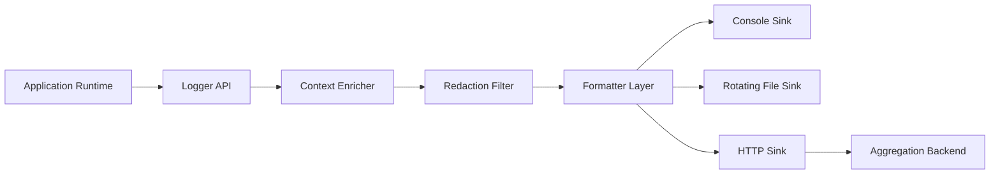
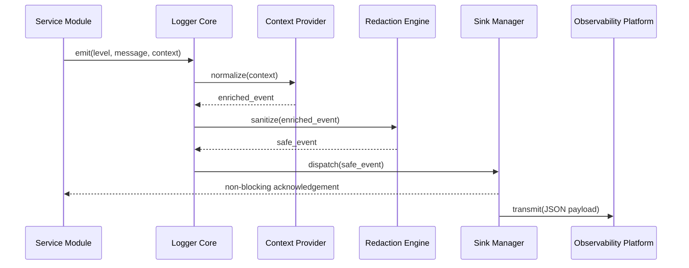

# GemeniAI Logger

Production-grade, structured Python logging for context-rich observability across local development, CI pipelines, and distributed runtime environments.

[](../../actions)
[](#)
[](LICENSE)
[](https://www.python.org/)
[](#testing)

> [!IMPORTANT]
> The current repository primarily contains workflow automation and legal metadata. This README documents the target library architecture, contract, and operational standards for contributors and adopters.

## Table of Contents

- [Title and Description](#gemeniai-logger)
- [Table of Contents](#table-of-contents)
- [Features](#features)
- [Tech Stack & Architecture](#tech-stack--architecture)
  - [Core Stack](#core-stack)
  - [Project Structure](#project-structure)
  - [Key Design Decisions](#key-design-decisions)
- [Getting Started](#getting-started)
  - [Prerequisites](#prerequisites)
  - [Installation](#installation)
- [Testing](#testing)
- [Deployment](#deployment)
- [Usage](#usage)
- [Configuration](#configuration)
- [License](#license)
- [Contacts & Community Support](#contacts--community-support)

## Features

- Structured event logging designed for machine-first ingestion and human-readable diagnostics.
- Canonical JSON payload support with deterministic field naming and schema versioning.
- Context propagation model for correlation identifiers, request identifiers, user/session metadata, and service dimensions.
- Multiple sink abstractions for `stdout`, rotating files, HTTP collectors, and custom pluggable transports.
- Configurable severity policy at global, module, and runtime levels.
- Secure payload sanitation through field-level redaction, optional masking, and hash-based obfuscation strategies.
- Resilient network delivery with retry/backoff semantics and non-blocking fail-soft behavior.
- Batch and stream modes for balancing throughput, latency, and memory constraints.
- Log pipeline observability hooks for sink latency, drop counters, and emitter backpressure indicators.
- Configuration-driven runtime behavior (`.env`, config file, CLI flags) to minimize code-level branching.
- CI-aligned execution model compatible with GitHub Actions and reproducible Python toolchains.
- Explicit operational posture for container-native deployments where `stdout` remains the primary transport.

> [!NOTE]
> The workflows in this repository currently standardize Python `3.11` execution and install `requests`, which should remain the baseline compatibility target for initial package scaffolding.

## Tech Stack & Architecture

### Core Stack

- **Primary language**: Python `3.11+`
- **Automation runtime**: GitHub Actions on `ubuntu-latest`
- **Dependency baseline**: `requests` (already used by CI workflows)
- **Interoperability targets**: command-line tools, backend APIs, asynchronous workers, and data processing services
- **Future-ready integrations**: ELK/OpenSearch, Loki, Datadog, Grafana Agent, Fluent Bit, and cloud-native log collectors

### Project Structure

```text
.
├── .github/
│   └── workflows/
│       ├── wiki-analysis-group.yml
│       └── wiki-analysis-solo.yml
├── LICENSE
└── README.md
```

### Key Design Decisions

1. **Structured-first event contract**  
   JSON is the canonical format so downstream systems can parse, index, and aggregate logs without regex-heavy transforms.

2. **Context as a mandatory envelope**  
   Every emitted event should include traceability metadata (`request_id`, `correlation_id`, `service`, `environment`) to support distributed incident analysis.

3. **Configuration over hard-coded behavior**  
   Runtime controls (levels, sinks, redaction policy, retry options) must be externally configurable to support environment-specific requirements.

4. **Fail-soft dispatch strategy**  
   Sink failures should never crash business logic; delivery errors are captured as telemetry and optionally routed to dead-letter storage.

5. **Schema evolution discipline**  
   Event payload schema should be versioned (`schema_version`) and changed with backward compatibility in mind.





> [!TIP]
> Keep field names stable and lowercase (for example: `timestamp`, `level`, `message`, `service`, `request_id`) to reduce downstream parser complexity.

## Getting Started

### Prerequisites

- Python `3.11` or newer
- `pip` and `venv`
- Git
- Optional for container workflows: Docker and Docker Compose
- Optional for development quality gates: `pytest`, `ruff`, `black`, `mypy`

### Installation

```bash
git clone https://github.com/<your-org>/wiki-analysis-gemeniAI.git
cd wiki-analysis-gemeniAI
python3.11 -m venv .venv
source .venv/bin/activate
python -m pip install --upgrade pip
pip install requests
```

Optional developer toolchain bootstrap:

```bash
pip install pytest ruff black mypy pyyaml
```

> [!WARNING]
> If your local `python` executable is not `3.11+`, explicitly run `python3.11` to stay aligned with CI behavior and avoid interpreter drift.

## Testing

At this stage, the repository does not yet include a dedicated package module with first-party unit tests. The following checks are recommended to validate the current automation footprint and prepare future quality gates.

Current repository validation:

```bash
python - <<'PY'
import yaml
for path in [
    '.github/workflows/wiki-analysis-group.yml',
    '.github/workflows/wiki-analysis-solo.yml',
]:
    with open(path, 'r', encoding='utf-8') as f:
        yaml.safe_load(f)
print('Workflow YAML files parsed successfully.')
PY
```

Recommended test and quality commands once implementation files are introduced:

```bash
pytest -q
ruff check .
black --check .
mypy .
```

> [!CAUTION]
> Treat the commands above as readiness targets until package modules and formal tests are committed.

## Deployment

### Production Deployment Guidelines

1. Build and publish immutable package artifacts using semantic versioning.
2. Configure runtime behavior with environment variables or mounted config files.
3. Prefer `stdout` logging in containers and delegate forwarding to platform collectors.
4. Pin dependency versions for deterministic builds and reproducible incident triage.
5. Gate releases through CI jobs that run tests, linting, and static analysis before publish.

### CI/CD Integration Strategy

- Use GitHub Actions for build, test, and release orchestration.
- Add branch protection rules requiring successful checks before merge.
- Separate pipelines for pull requests (`validate`) and tagged releases (`publish`).
- Store credentials in CI secret stores, never in repository files.

Example minimal container baseline:

```dockerfile
FROM python:3.11-slim
WORKDIR /app
COPY . .
RUN pip install --no-cache-dir requests
CMD ["python", "-m", "your_logging_service"]
```

Example compose snippet for local integration:

```yaml
services:
  app:
    build: .
    environment:
      LOG_LEVEL: INFO
      LOG_FORMAT: json
      LOG_OUTPUT: stdout
```

## Usage

The following example demonstrates a practical structured logger baseline with JSON output and contextual enrichment.

```python
import json
import logging
from datetime import datetime, timezone

class JsonFormatter(logging.Formatter):
    def format(self, record):
        payload = {
            "timestamp": datetime.now(timezone.utc).isoformat(),
            "level": record.levelname,
            "logger": record.name,
            "message": record.getMessage(),
            "request_id": getattr(record, "request_id", None),
            "correlation_id": getattr(record, "correlation_id", None),
            "schema_version": 1,
        }
        return json.dumps(payload, ensure_ascii=False)

logger = logging.getLogger("gemeniai.logger")
logger.setLevel(logging.INFO)

stream_handler = logging.StreamHandler()
stream_handler.setFormatter(JsonFormatter())
logger.addHandler(stream_handler)

logger.info(
    "Service boot completed",
    extra={"request_id": "boot-001", "correlation_id": "corr-boot"},
)

logger.error(
    "HTTP sink timeout during dispatch",
    extra={"request_id": "req-42", "correlation_id": "corr-7f92"},
)
```

Recommended advanced usage patterns for implementation:

- Queue-backed asynchronous sink manager for burst-safe throughput.
- Policy-based redaction with field list, regex rules, and optional hashing.
- Per-sink retry and timeout profiles with dead-letter fallback.
- Domain-specific logger adapters for API, worker, and scheduler workloads.

## Configuration

### Environment Variables

| Variable | Required | Default | Description |
|---|---:|---|---|
| `LOG_LEVEL` | No | `INFO` | Global minimum severity (`DEBUG`, `INFO`, `WARNING`, `ERROR`, `CRITICAL`). |
| `LOG_FORMAT` | No | `json` | Event serialization format (`json`, `text`). |
| `LOG_OUTPUT` | No | `stdout` | Primary sink mode (`stdout`, `file`, `http`). |
| `LOG_FILE_PATH` | No | `./logs/app.log` | Output destination when file sink is enabled. |
| `LOG_HTTP_ENDPOINT` | No | _empty_ | Remote collector endpoint for HTTP sink dispatch. |
| `LOG_HTTP_TIMEOUT_SECONDS` | No | `3` | Request timeout for HTTP sink submissions. |
| `LOG_REDACT_FIELDS` | No | `password,token,secret` | Comma-separated keys to sanitize from payloads. |
| `LOG_BATCH_SIZE` | No | `100` | Maximum events per batch in buffered mode. |
| `LOG_FLUSH_INTERVAL_MS` | No | `2000` | Flush interval cap for buffered dispatch. |
| `LOG_RETRY_MAX_ATTEMPTS` | No | `5` | Maximum delivery attempts for retryable sinks. |
| `LOG_RETRY_BACKOFF_SECONDS` | No | `2` | Backoff interval between retries. |
| `LOG_SCHEMA_VERSION` | No | `1` | Event schema contract version for downstream compatibility. |

### `.env` Example

```env
LOG_LEVEL=INFO
LOG_FORMAT=json
LOG_OUTPUT=stdout
LOG_REDACT_FIELDS=password,token,secret,api_key
LOG_BATCH_SIZE=200
LOG_FLUSH_INTERVAL_MS=1000
LOG_RETRY_MAX_ATTEMPTS=5
LOG_RETRY_BACKOFF_SECONDS=2
LOG_SCHEMA_VERSION=1
```

### Configuration File Example (`logging.yml`)

```yaml
level: INFO
format: json
schema_version: 1
sinks:
  - type: stdout
  - type: file
    path: ./logs/app.log
    rotate:
      max_bytes: 10485760
      backup_count: 5
  - type: http
    endpoint: https://logs.example.com/ingest
    timeout_seconds: 3
    retry:
      max_attempts: 5
      backoff_seconds: 2
redaction:
  fields: [password, token, api_key]
  strategy: mask
```

### Startup Flag Concept (Future CLI)

```bash
python -m gemeniai_logger \
  --log-level INFO \
  --log-format json \
  --log-output stdout \
  --schema-version 1
```

> [!IMPORTANT]
> Never commit real credentials or private endpoints to `.env` or YAML configuration files. Use your CI/CD secret manager and runtime secret injection.

## License

This project is distributed under the **GNU General Public License v3.0 (GPL-3.0)**. See [`LICENSE`](LICENSE) for complete terms.

## Contacts & Community Support

## Support the Project

[](https://www.patreon.com/OstinFCT)
[](https://ko-fi.com/fctostin)
[](https://boosty.to/ostinfct)
[](https://www.youtube.com/@FCT-Ostin)
[](https://t.me/FCTostin)

If you find this tool useful, consider leaving a star on GitHub or supporting the author directly.
