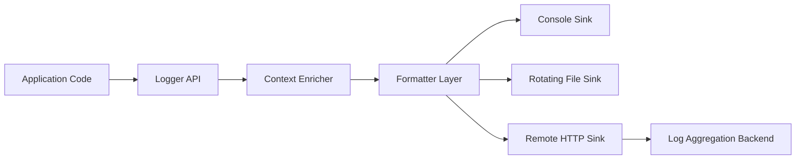
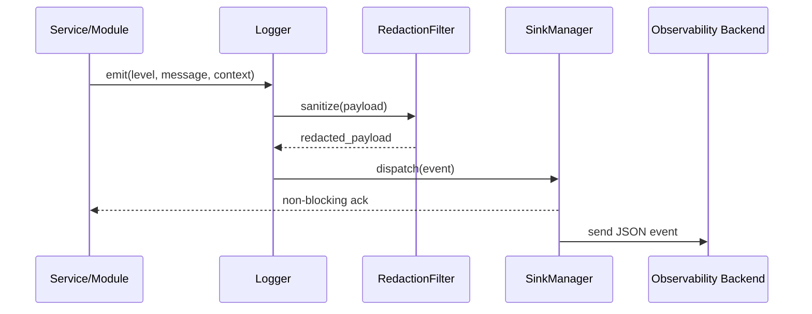

# GemeniAI Logger

A production-oriented Python logging library that standardizes structured, context-rich, and pipeline-friendly observability across local development, CI workflows, and distributed services.

[](../../actions)
[](#)
[](LICENSE)
[](https://www.python.org/)

> [!IMPORTANT]
> This repository currently contains GitHub Actions automation and legal metadata; the README below documents the intended logging-library architecture and usage conventions for implementation and contributor alignment.

## Table of Contents

- [Features](#features)
- [Tech Stack & Architecture](#tech-stack--architecture)
- [Getting Started](#getting-started)
- [Testing](#testing)
- [Deployment](#deployment)
- [Usage](#usage)
- [Configuration](#configuration)
- [License](#license)
- [Support the Project](#support-the-project)

## Features

- Structured logging with JSON and human-readable formatter support.
- Context propagation (request ID, correlation ID, user/session tags).
- Multiple sink targets: `stdout`, file rotation, webhook, and custom handlers.
- Log level controls per module, environment, and runtime override.
- Secure redaction filters for secrets, tokens, and PII-like payloads.
- Resilient transport strategy with retry/backoff for remote log sinks.
- Batch and stream emission modes for high-throughput services.
- Runtime metrics hooks for log volume, drop count, and sink latency.
- Environment-driven configuration (`.env` + startup flags).
- CI-first integration model compatible with GitHub Actions workflows.

> [!NOTE]
> The current workflows already standardize Python `3.11` setup and `requests` installation, which are reflected in the recommended baseline stack.

## Tech Stack & Architecture

### Core Stack

- **Language**: Python `3.11+`
- **Primary dependency baseline**: `requests` (already used in CI workflows)
- **Execution environment**: GitHub Actions (`ubuntu-latest`)
- **Target interoperability**: CLI services, automation jobs, web backends, data pipelines

### Project Structure

```text
.
├── .github/
│   └── workflows/
│       ├── wiki-analysis-group.yml
│       └── wiki-analysis-solo.yml
├── LICENSE
└── README.md
```

### Key Design Decisions

1. **Structured-first logging**: JSON payload as the canonical event format to support ingestion by ELK/OpenSearch, Datadog, Loki, and cloud-native collectors.
2. **Context as a first-class concern**: all event records should include deterministic context fields to enable traceability across asynchronous boundaries.
3. **Configuration-over-code**: environment variables and config files should drive behavior so deployment environments can tune verbosity and sinks without code changes.
4. **Fail-soft sink behavior**: sink failures should not crash application code; they must degrade gracefully with internal telemetry.





> [!TIP]
> Keep the log schema stable across services. Version it explicitly (for example, `schema_version: 1`) to avoid breaking downstream parsers.

## Getting Started

### Prerequisites

- Python `3.11` or newer
- `pip` and `venv`
- Git
- Optional: Docker (for containerized local development)

### Installation

```bash
git clone https://github.com/<your-org>/wiki-analysis-gemeniAI.git
cd wiki-analysis-gemeniAI
python3.11 -m venv .venv
source .venv/bin/activate
pip install --upgrade pip
pip install requests
```

> [!WARNING]
> If your system defaults to another Python version, pin `python3.11` explicitly to match CI behavior.

## Testing

The repository currently does not ship a dedicated Python package test suite, but you can validate automation and YAML integrity with the following commands:

```bash
# Basic YAML lint via Python parser
python - <<'PY'
import yaml
for path in [
    '.github/workflows/wiki-analysis-group.yml',
    '.github/workflows/wiki-analysis-solo.yml',
]:
    with open(path, 'r', encoding='utf-8') as f:
        yaml.safe_load(f)
print('Workflow YAML files parsed successfully.')
PY

# Optional: syntax-check inline Python fragments used in workflows
python -m py_compile /tmp/nonexistent.py || true
```

Recommended future quality gates for the logging library:

- Unit tests: `pytest -q`
- Lint: `ruff check .`
- Format: `black .`
- Type checks: `mypy .`

> [!CAUTION]
> Replace placeholders with concrete commands as soon as the package modules and test folders are introduced.

## Deployment

### GitHub Actions Integration

Two manual-dispatch workflows are already configured:

- `AI Wiki Analysis group`: generates multiple wiki pages in one run.
- `AI Wiki Analysis solo`: generates a single targeted wiki page and updates TOC.

### Production Recommendations for Logging Library Deployment

1. Package and publish the library to an internal index (or PyPI) with semantic versioning.
2. Inject runtime configuration using environment variables in CI/CD.
3. Route logs to `stdout` in containers and let platform collectors (e.g., Fluent Bit) forward them.
4. Enforce immutable image builds and pin dependency versions.

Example container baseline:

```dockerfile
FROM python:3.11-slim
WORKDIR /app
COPY . .
RUN pip install --no-cache-dir requests
CMD ["python", "-m", "your_logging_service"]
```

## Usage

Below is a practical usage pattern for a structured logger API design.

```python
import logging
import json
from datetime import datetime

class JsonFormatter(logging.Formatter):
    def format(self, record):
        payload = {
            "timestamp": datetime.utcnow().isoformat() + "Z",  # UTC event timestamp
            "level": record.levelname,                          # Severity
            "logger": record.name,                              # Logger namespace
            "message": record.getMessage(),                     # Rendered message
            "request_id": getattr(record, "request_id", None),# Correlation field
        }
        return json.dumps(payload)

logger = logging.getLogger("gemeni.logger")
logger.setLevel(logging.INFO)

stream_handler = logging.StreamHandler()
stream_handler.setFormatter(JsonFormatter())
logger.addHandler(stream_handler)

# Emit structured events with contextual metadata
logger.info("Service started", extra={"request_id": "boot-001"})
logger.error("Remote sink timeout", extra={"request_id": "req-42"})
```

Advanced usage objectives for the library implementation:

- Async-safe queue handler for high-throughput pipelines.
- Policy-based redaction (`fields`, `regex`, `hashing strategy`).
- Per-sink retry policy and dead-letter storage.

## Configuration

### Environment Variables

| Variable | Required | Default | Description |
|---|---:|---|---|
| `LOG_LEVEL` | No | `INFO` | Global minimum severity (`DEBUG`, `INFO`, `WARNING`, `ERROR`, `CRITICAL`). |
| `LOG_FORMAT` | No | `json` | Output format (`json`, `text`). |
| `LOG_OUTPUT` | No | `stdout` | Primary sink (`stdout`, `file`, `http`). |
| `LOG_FILE_PATH` | No | `./logs/app.log` | Destination path when `LOG_OUTPUT=file`. |
| `LOG_HTTP_ENDPOINT` | No | _empty_ | Remote ingestion endpoint for HTTP sink. |
| `LOG_REDACT_FIELDS` | No | `password,token,secret` | Comma-separated sensitive keys to redact. |
| `LOG_BATCH_SIZE` | No | `100` | Number of events per batch in async/buffered mode. |
| `LOG_FLUSH_INTERVAL_MS` | No | `2000` | Max interval before batch flush. |
| `LOG_SCHEMA_VERSION` | No | `1` | Event schema compatibility version. |

### `.env` Example

```env
LOG_LEVEL=INFO
LOG_FORMAT=json
LOG_OUTPUT=stdout
LOG_REDACT_FIELDS=password,token,secret,api_key
LOG_BATCH_SIZE=200
LOG_FLUSH_INTERVAL_MS=1000
LOG_SCHEMA_VERSION=1
```

### Configuration File Example (`logging.yml`)

```yaml
level: INFO
format: json
schema_version: 1
sinks:
  - type: stdout
  - type: file
    path: ./logs/app.log
    rotate:
      max_bytes: 10485760
      backup_count: 5
  - type: http
    endpoint: https://logs.example.com/ingest
    timeout_seconds: 3
    retry:
      max_attempts: 5
      backoff_seconds: 2
redaction:
  fields: [password, token, api_key]
  strategy: mask
```

> [!IMPORTANT]
> Never commit real credentials, API keys, or private endpoints into `.env` files. Use secret managers in CI/CD and production.

## License

This project is distributed under the **GNU General Public License v3.0 (GPL-3.0)**. See [`LICENSE`](LICENSE) for complete terms.

## Support the Project

[](https://www.patreon.com/OstinFCT)
[](https://ko-fi.com/fctostin)
[](https://boosty.to/ostinfct)
[](https://www.youtube.com/@FCT-Ostin)
[](https://t.me/FCTostin)

If you find this tool useful, consider leaving a star on GitHub or supporting the author directly.
